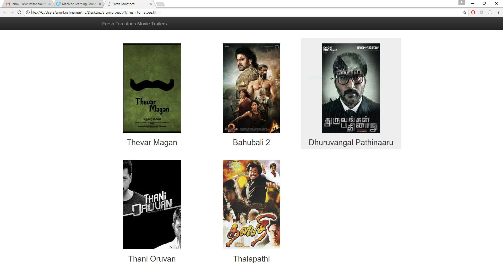

# Movie trailer website
Source code for a Movie Trailer website.

### Screenshot


### Prerequisites

In order to be able to run this program you will need to have installed Python 2.7.* or above

If you don't have Python installed on your computer you can download it from the following link:

[Download Python](https://www.python.org/downloads/)

### Running the program

Just run the command below in the project's root folder. Your WebBrowser will be opened automatically. (Note : Works only if python path variable is configured properly)

```
python entertainment_center.py
```

## Author

Arun K

## Credits
[adarsh0806](https://github.com/adarsh0806/ud036_StarterCode)